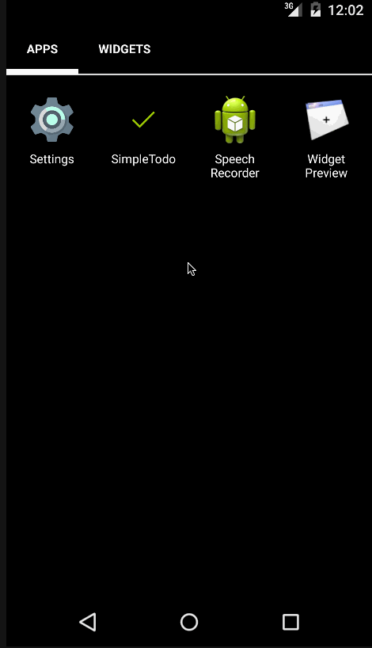

# SimpleTodo
Simple Todo List for Android

##Requirements:

* Android SDK v23
* Andrpod Studio v1.3+

## Supported User Scenarios:

* Add Todo item
* Edit Todo item
    * Single click to mark item completed.
    * Long click to open edit window.
        * Save edited item
            * Title
            * Due Date
            * Completed Status
        * Discard changes to item
        * Delete Todo item.

## Features:

* Past due, incomplete items show due date red.
* Task completion indicator
    * Items completed show up grey and normal text.
    * Items not completed show up bold and black.

## Known Issues:

* Date entry should use date picker.
* Issue entry should be a fragment and be swapped with edit window.
* Data should be stored in sqlite, not csv.
* Data could be passed between activity and fragment without accessors.

## Sample Walk-Through

* Add Item
* Edit Item
    * Close without saving
    * Edit item
    * Remove item
* Show Past Due Item
    * Not Completed
    * Completed
* Load list on launch

### Walk-Through GIF

